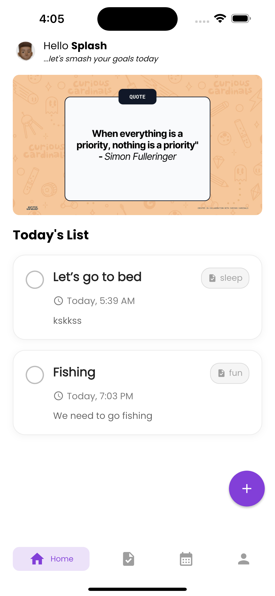
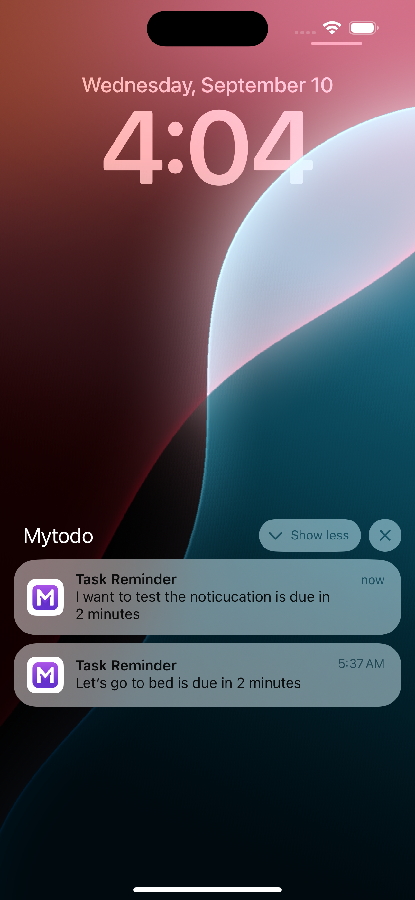
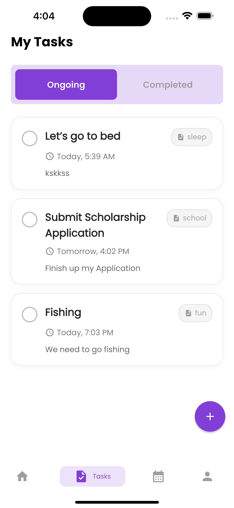
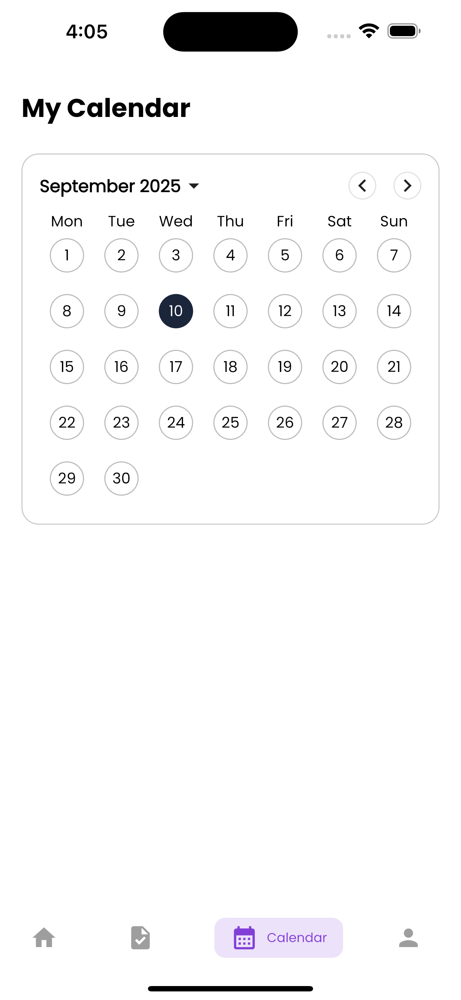
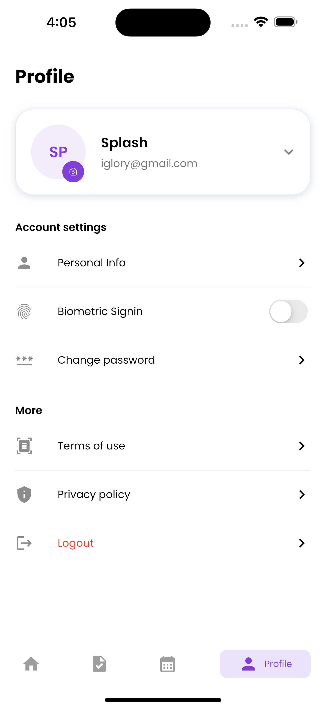
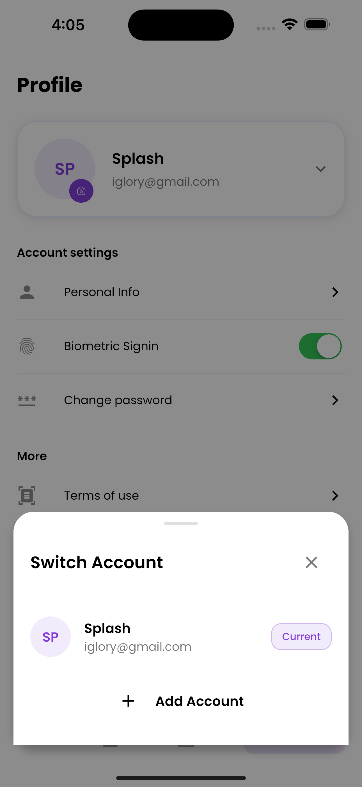

# My Todo🔥 

An Assesment task that serves as a todo list to track everyday activities. A push Notification to remind the user of the task.


## ✨ Requirements

- Any Operating System (ie. MacOS X, Linux, Windows)
- Any IDE with SDK installed (ie. IntelliJ, Android Studio, VSCode etc)
- A little knowledge of Flutter

## 🎬 Demo Video

[![Demo Video]] https://www.youtube.com/watch?v=OK74VBVgZAw

*Click the link above to watch the demo video*

## 📸 ScreenShots

     
    
    

## 📁 Folder Structure

```
mytodo/
├── assets/
│   └── ss/
├── lib/
│   ├── main.dart
│   ├── models/
│   ├── screens/
│   ├── widgets/
├── pubspec.yaml
└── README.md
```

## ⚡ Functionality

- Add, edit, and delete todo items
- Multiuser
- Mark tasks as completed or pending
- View all tasks in a list
- Persistent storage of todos
- Responsive UI for different devices

## 🚀 Future Improvements

- Work more on the calendar to show all task for each day
- A graph showing how the user is performing with task
- Sync todos with cloud storage
- Add user authentication with Firebase
- Dark mode support
- Improved animations and UI enhancements
- Export/import todo lists

## 🤓 Author(s)

**Olaifa Glory Israel** [](https://x.com/kxSplash)

## 🔖 LICENCE

[WTFPL](http://www.wtfpl.net/about/)